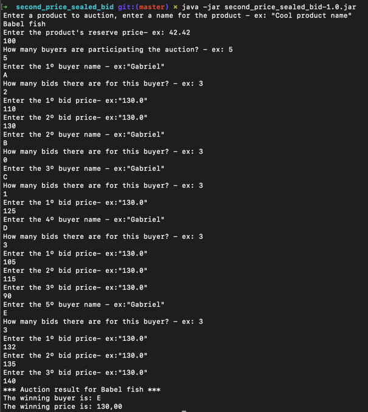

# Second-price, sealed-bid auction
In this project, I'm implementing a version of a second-price, sealed-bid auction.  The auction rules are the following:
- There is a product to auction with a reserve price.
- There can be several potential bidders, with each one being able to place any number of bids (>=0).
- The auction's winner is the bidder that bid the highest price above or equal the reserve price
- The winning price is the highest bid price from a non-winning bidder above the reserve price (or the reserve price if none applies)

## Getting started
- Install the [Java Development Kit (JDK)](https://www.oracle.com/technetwork/java/javase/downloads)
- Install the [IntelliJ IDEA](https://www.jetbrains.com/idea/download/index.html) 
   (this step is not strictly necessary, but given it was the IDE used for this project's development,
  and the great synergy between kotlin and IntelliJ IDEA you'll save a lot of time in the process of making everything work if you do it ;) ) 
- If you opt not to use the IntelliJ IDE, you can install the kotlin compiler following [this guide](https://kotlinlang.org/docs/command-line.html#homebrew)
- Clone the repository / unzip and open it in your preferred IDE

## Running and testing
### Running
There are two ways of running this project:
- The quickest one is to just use the provided `second_price_sealed_bid-1.0.jar` in the root of the project, you can execute it in the terminal using
   `java -jar second_price_sealed_bid-1.0.jar`
- The second option is to compile the source and run it afterward, using IntelliJ IDEA you can just click the Run icon in the gutter and select Run 'MainKt' or press ⌃⇧R. 

### Testing
All the tests are located in the `/src/test`. The folder structure mirrors the actual classes.
For example, you will find the `AuctionSolverTest.kt` in the `src/test/kotlin/domain/entities/AuctionSolverTest.kt` 

To execute the tests you can use the command:
`./gradlew check`
 Another alternative is to run directly from IntelliJ IDEA by using the gutter icon.

## Project structure
The project is divided into 3 main layers:

- `domain` holds the business logic and the data representations that are used across the application. Here, for example, you will find the `AuctionSolver.kt` responsible for applying the aforementioned auction rules
- `data` holds the repositories, providing an interface with the data layer
- `presentation` contains the classes responsible for providing an interface between the user and the application business logic. The class responsible for handling the interaction with a user through the console is located here. 

## Dependencies
- [Mockito-Kotlin](https://github.com/mockito/mockito-kotlin) - Mockito is a mocking framework that tastes really good. It lets you write beautiful tests with a clean & simple API.

## Screenshots

